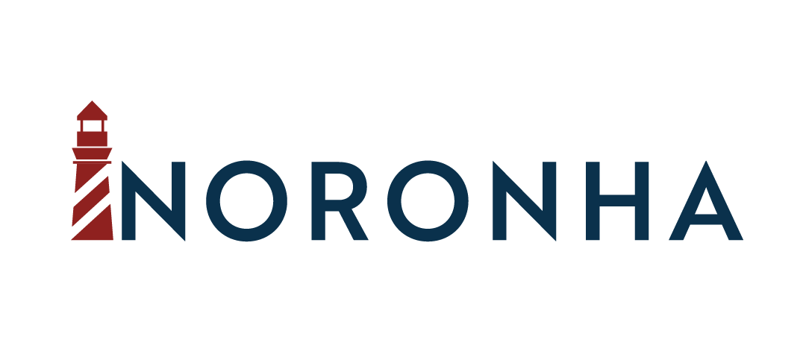

# Noronha DataOps



Noronha is a Python framework designed to help you orchestrate and manage ML projects life-cycle.

It hosts Machine Learning models inside a portable, ready-to-use DataOps architecture, thus helping you benefit from DataOps and MLOps practices without having to change much of your usual work behavior.

The architecture consists of three components:
- File storage: Artifactory, Nexus, Apache Cassandra
  - A raw storage of your choice is used to version ML assets, such as notebooks, datasets and model binaries. Noronha currently supports Artifactory (default) and Nexus for this task, while Apache Cassandra can be used only as model binary storage.
- Metadata storage: MongoDB
  - Mongo document design is used to guide the framework while managing your ML project, therefore it cannot be swapped with other technologies.
- Model router: NodeJS (optional)
  - A router can be set up to act as a single entrypoint for all your models. This is especially useful when deploying in Kubernetes, where service exposure comes into play.

These components are internally called isles, they can be used in native mode (managed by Noronha) or foreign mode (managed by user).

### Prerequisites
To use the framework in its most basic configuration all you need is:

- Any recent, stable Unix OS.
- [Docker v17+](<https://docs.docker.com/install/>) with [Swarm mode](https://docs.docker.com/engine/swarm/) enabled and [configured to be used without sudo](https://docs.docker.com/install/linux/linux-postinstall/).
- A [Conda v4.5+](https://docs.conda.io/projects/conda/en/latest/user-guide/install/download.html) environment with Python v3.5+.
- [Git v2+](https://git-scm.com/book/en/v2/Getting-Started-Installing-Git).

### Getting started
```
pip install noronha-dataops
nha --debug --pretty get-me-started
```

After installing the framework, the command-line option `noronha` or `nha` becomes available. Every command has the `--help` option, use it constantly.

The `get-me-started` option will set up Artifactory and MongoDB instances in native mode.

`--debug` and `--pretty` help debugging and reading error messages. Use their short version instead: `nha -d -p`

### 3) Basic usage
Once you have successfully installed Noronha, start with the simplest project structure:

<pre>
project_home:
+-- Dockerfile
+-- requirements.txt
+-- notebooks/
    +-- training.ipynb
    +-- predict.ipynb
</pre>

This is what the Dockerfile may look like:
<pre>
# default public base image for working inside Noronha
FROM noronhadataops/noronha:latest

# project dependencies installation
ADD requirements.txt .
RUN bash -c "source ${CONDA_HOME}/bin/activate ${CONDA_VENV}  && \
    conda install --file requirements.txt"

# deploying the project's code
ADD notebooks ./notebooks
</pre>

From your project home folder, record it in Noronha and build a new image:

```
nha -d -p proj new --name my-first-proj --desc "Testing project" --home-dir .
nha -d -p proj build --tag develop
```

Then, run Jupyter Notebook interface for editing and testing code:

```
nha -d -p note --edit --tag develop --port 9090
```

`--edit` will mount your current directory into the container. This is useful if you want to edit code, test it and save it in the local machine (remember to be in the right directory when using this option).

`--port` host port that will be routed to the notebook's UI

Go to your browser and enter: `http://localhost:9090/`

### Next steps
For fully-working project template and end-to-end tutorial, see the [iris example](https://github.com/noronha-dataops/noronha/tree/master/examples/1_iris).

For more information about Noronha and advanced usage of the framework, check [readthedocs](https://noronha.readthedocs.com).

If you want to know how to run in Kubernetes, check this [guide](https://noronha.readthedocs.com).

### Report issues and request features
If you run into any problem or feel like there is some funcionality that should be added, please consider submiting an [issue](https://github.com/noronha-dataops/noronha/issues).

We also monitor Stack Overflow questions that use the tag: #noronha-dataops.

If you like mailing lists, here is our [Google Groups](https://groups.google.com/g/noronha-dataops): [noronha-dataops@googlegroups.com](mailto:noronha-dataops@googlegroups.com).

### Contributing
Please read our [contributing guide](https://github.com/noronha-dataops/noronha/blob/master/CONTRIBUTING.md).
