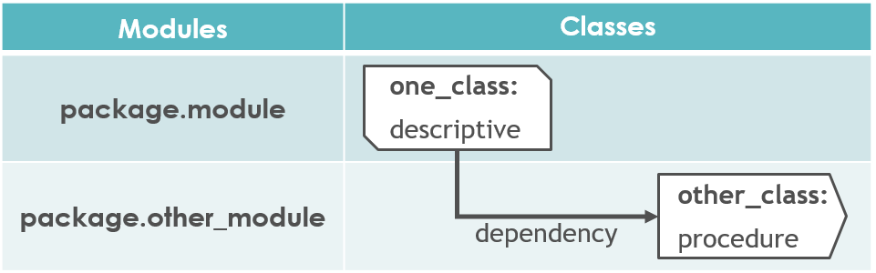
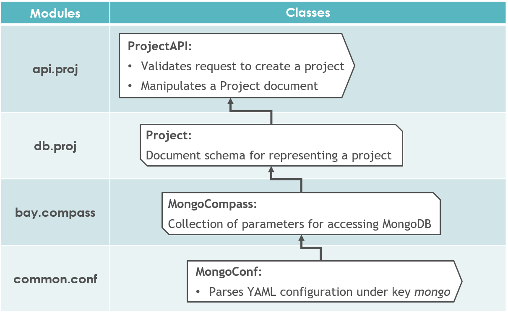
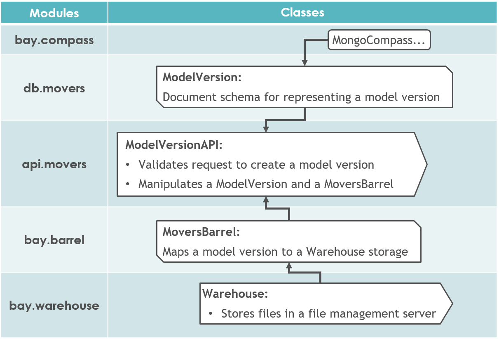
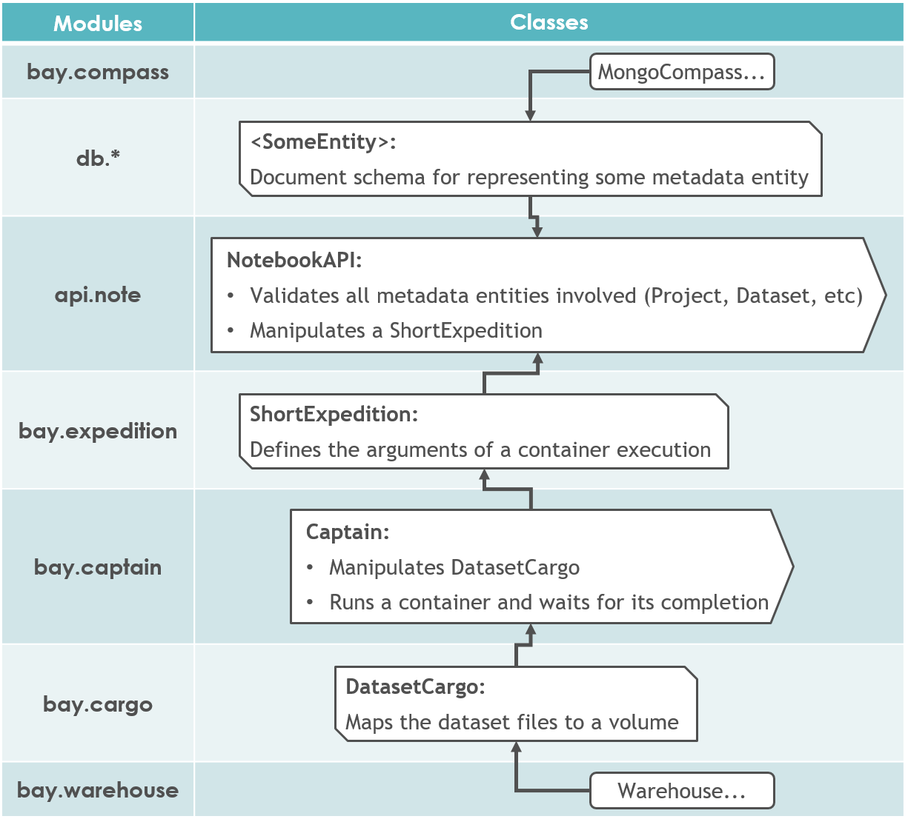

*********************
Modules Relationship
*********************
.. highlight:: none

As Noronha performs a task - such as publishing a model or running a training - it relies on several modules that
interact in order to produce the expected result. This section explains the relationships that occur between those
modules when performing the most common tasks. 

The following caption illustrates the conventions used for representing those relationshipts in the each of the topics bellow:

Creating a project
==================

Publishing a model version
==========================

Launching the IDE
=================

