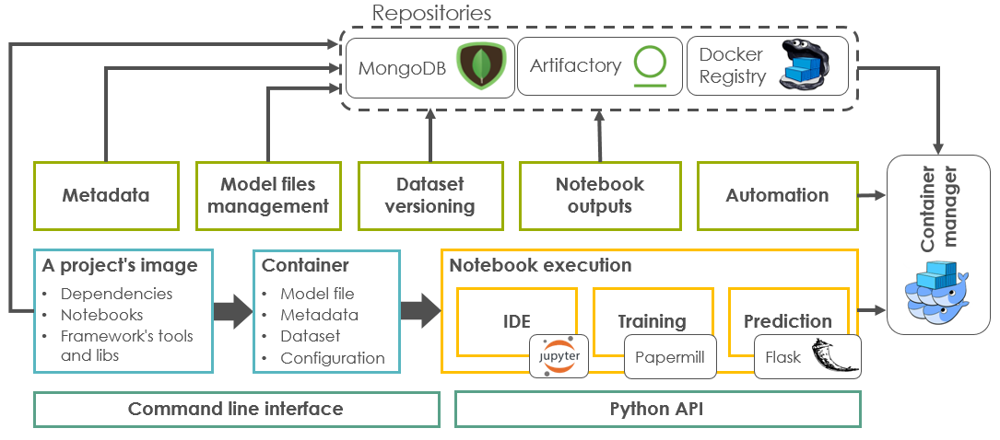
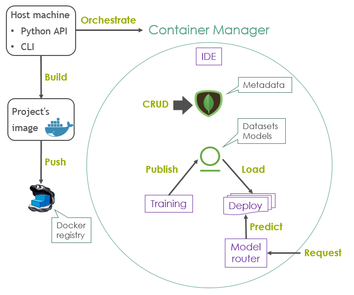

******************
Key Concepts
******************

This section describes some important concepts that usually come up when working with Noronha. It's recommended that you read and understand them in order to use the framework correctly.

The image bellow summarizes the components that compose the framework:

.. _project-repositories:

Project Repositories
====================
Noronha supports three kinds of project repositories:

- **Local:** the project code resides in a local directory.
- **Git:** the project code resides in a remote Git repository.
- **Docker:** the project code resides in a Docker repository.

For the first two kinds (local, git) the framework assumes that your project contains a Dockerfile that uses noronha.everis.ai/noronha as its base image. Everytime you build your project with Noronha it's going create a Docker image for the project and record some metadata related to it.

This is a common Dockerfile to be used with Noronha::

    FROM noronha.everis.ai/noronha:1.0.0

    ADD requirements.txt .
    RUN bash -c "source ${CONDA_HOME}/bin/activate ${CONDA_VENV} \
     && pip install -r requirements.txt \
     && rm -f requirements.txt"

    ADD . ${APP_HOME}

You can also find other common Dockerfile structures in the `examples section <https://gitlab.eva.bot/asseteva/noronha-dataops/tree/master/examples>`_.

For the third kind of repository (docker) the framework assumes that the image is already managed by the user or a third-party, thus it's ready to use and no builds will be performed by the framework itself.

Containers and Notebooks
========================
Why do we build projects into Docker images? That's because in Noronha every project task is basically a notebook execution that happens inside a container, and the project's image is used to create those containers:

- **IDE:** Jupyter Notebook inside a container, for editing and testing your code in an interactive manner.
- **Train:** Model training inside a container. It's basically an execution of the training notebook. Usually, by the end of the execution a model version is produced.
- **Deploy:** Prediction service inside a group of containers with one or more replicas. Here, the prediction notebook is used to sustain an HTTP endpoint for serving prediction requests.

You can find templates for structuring your training and prediction notebooks in the `examples section <https://gitlab.eva.bot/asseteva/noronha-dataops/tree/master/examples>`_.

.. _island-concepts:

Islands (Plugins)
=================
There is also a fourth kind of container that we call an "island". This is like an embedded plugin, a container which is created and managed by the framework itself and that is responsible for performing some useful task. In this case, the image used to create the container depends on the task its meant to perform.

These are the default islands:

- **MongoDB:** Database for storing metadata related to everything in this framework (projects, models, build versions, etc). See the :ref:`data model section <data-model-guide>` for further info.
- **Artifactory:** File manager for storing model files, small datasets and notebook execution outputs.

These are the optional islands:

- **Router:** simple Node.js proxy that routes prediction requests to the respective model deployments.
- **Nexus:** alternative file manager that you can use instead of Artifactory.

Instead of using a native (embedded) island, the file management and metadata storage tasks can also be performed by foreign (external, dedicated) instances, managed by the user or a third party (e.g.: a huge Nexus server in you company's cloud or even a MongoDB cluster). To setup Noronha in this kind of environment see the :ref:`configuration guide <configuration-guide>`.

.. _orchestration-concepts:

Orchestration
=============
Noronha relies on a container manager to manipulate its containers. This can be either of:

- **Docker Swarm:** This is the default container manager, and it's meant for experimenting with the framework in a local, non-distributed environment.
- **Kubernetes:** This is the recommended container manager for working with multiple projects and users in a real productive cluster. To configure Noronha to use Kubernetes as its container manager, see the :ref:`configuration guide <configuration-guide>`.

The image below illustrates how the framework components interact inside and outside the container manager. However, this is a simplified representation, since in reality multiple trainings and/or deployments belonging to one or more projects may coexist in the same environment.

Note that the *host machine* may be a local computer or even one of the servers that compose the container manager's node pool. The framework's libraries also need to be present in this host so that it can use Noronha's API to interact with the container manager. Usually, a host like this is referred to as *off board*, since it's not running inside a container, whereas IDE, training and deployments are referred to as *on board*.
