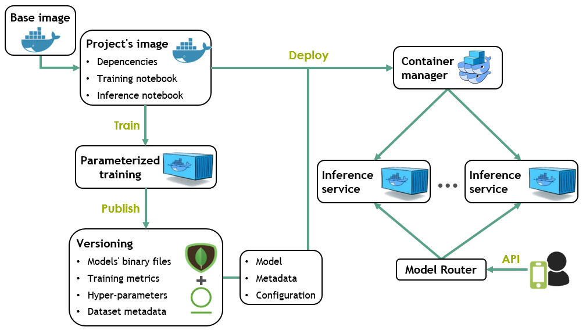

******************
Introduction
******************

What's this?
============
Noronnha is a framework that hosts Machine Learning projects inside a portable, ready-to-use DataOps architecture.
The goal here is to help Data Scientists benefit from DataOps practices without having to change much of their usual work behavior.

Overview
========
The following steps and the diagram bellow describe together the basic training and deploying workflow
of a Machine Learning project inside Noronha:

    #. Noronha's base image is used as a starting point to provide the tools a project needs to run inside the framework.

    #. The project is packed in a Docker image with its dependencies, a training notebook and a notebook for inference.

    #. Every training is a parameterized execution of the training notebook, inside a container of the project's image.

    #. Every model version produced is published to a versioning system in which MongoDB stores metadata and a file manager like Artifactory               stores raw files and binaries.

    #. When deploying a model, containers of the project's image are created for running the inference notebook as a service. Every asset                  necessary is injected into the containers.

Pre-requisites
==============
To use Noronha in its most basic configuration all you need is:

    - Any recent, stable Unix OS.
    - `Docker v17+ <https://docs.docker.com/install/>`_ installed with `Swarm mode <https://docs.docker.com/engine/swarm/>`_ enabled.
    - A `Conda v4.5+ <https://docs.conda.io/projects/conda/en/latest/user-guide/install/download.html>`_ environment with Python v3.5+.
    - `Git v2+ <https://git-scm.com/book/en/v2/Getting-Started-Installing-Git>`_.

For a more advanced usage of the framework, see the :ref:`configuration guide <configuration-guide>`.

Installation
============
.. _installation-intro:

You can easily install Noronha by activating your Conda environment and running the following commands:

.. parsed-literal::

    pip install git+https://gitlab.eva.bot/asseteva/noronha-dataops
   
    nha get-me-started

This assumes you're going to use the default plugins (MongoDB and Artifactory) in native mode (auto-generated instances).
To use plugins differently, see the :ref:`configuration guide <configuration-guide>`.

Basic usage
===============
Let's start with the simplest project structure:

.. parsed-literal::

    project_home:
    +-- Dockerfile
    +-- requirements.txt

This is what the Dockerfile may look like:

.. parsed-literal::

    # default public base image for working inside Noronha
    FROM noronha.everis.ai/noronha:develop

    # project dependencies installation
    ADD requirements.txt .
    RUN bash -c "source ${CONDA_HOME}/bin/activate ${CONDA_VENV} \
     && conda install --file requirements.txt"

    # deploying the project's code
    ADD . ${APP_HOME}

Now record your project's metadata and build it:

.. parsed-literal::

    nha proj new --name my-proj
    nha proj build --tag develop

Then, run the Jupyter Notebook interface inside your project's image for editing and testing code:

.. parsed-literal::

    nha note --edit --tag develop

For fully-working project templates and end-to-end tutorials, see the `examples directory <https://gitlab.eva.bot/asseteva/noronha-dataops/tree/master/examples>`_.
