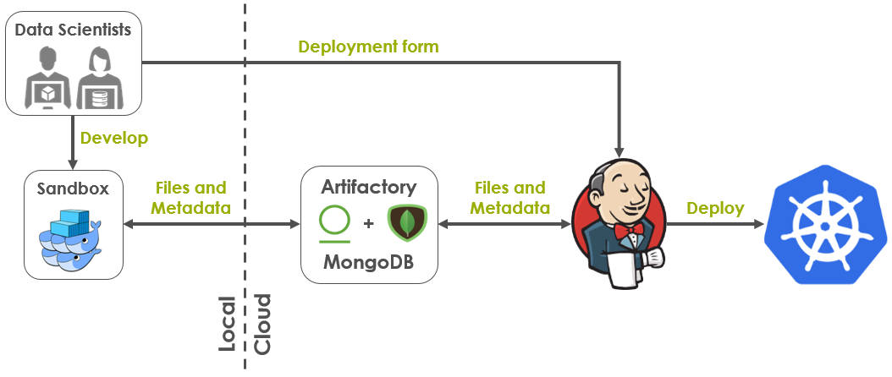
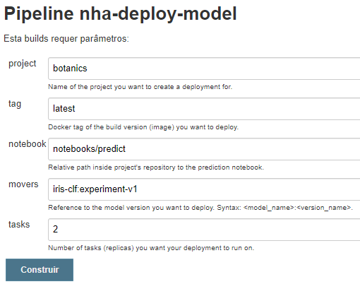

# Example: Jenkins

In most projects it's necessary to isolate the target environment and restrict the Data Scientist's work to a sandbox.

The architecture bellow represents an alternative for working with Noronha under such restrictions:

The sandbox and the Jenkins server use both the same MongoDB and Artifactory (or Nexus) instances for managing metadata and files. This way, everyone sees the same assets (projects, models, etc...) when interacting with Noronha.

As the Data Scientist works, every notebook execution runs on top of Docker Swarm in the local machine. Then, after a model has been properly validated in the sandbox, a Jenkins form can be filled to request a deployment in the target environment.

## Pre-requisites

Before setting up this architecture you'll need:

1. A Kubernetes cluster with:
    * Access to a Docker registry (private or not)
    * Access to an NFS server (dedicated or in a Pod)
2. A Jenkins server with:
    * Noronha installed
    * Kubectl configured and authenticated to your Kubernetes cluster
3. A MongoDB server
4. An Artifactory (or Nexus) server with:
    * A raw repository for storing Noronha's files
5. A Git server (private or not)
6. A local machine with Noronha installed

## Setup

Steps for setting up this architecture:

1. Place the file [local_sandbox.nha.yaml](https://gitlab.eva.bot/asseteva/noronha-dataops/blob/master/examples/jenkins/jenkins_server.nha.yaml) at ~/.nha/nha.yaml in your local machine. Edit the properties inside this file to match your envinronment's configuration.

2. Place the file [jenkins_server.nha.yaml](https://gitlab.eva.bot/asseteva/noronha-dataops/blob/master/examples/jenkins/jenkins_server.nha.yaml) at ~/.nha/nha.yaml in your Jenkins server. Edit the properties inside this file to match your envinronment's configuration.

3. Use the file [Jenkinsfile](https://gitlab.eva.bot/asseteva/noronha-dataops/blob/master/examples/jenkins/Jenkinsfile) to create a parameterized pipeline in your Jenkins server.

## Usage 

After setting up the architecture, follow this steps to work inside it: 

* Just go on using Noronha in the local machine, like it's shown in the [iris example](https://gitlab.eva.bot/asseteva/noronha-dataops/blob/master/examples/iris).

* Don't forget to commit your project to the Git repository before building it with `nha proj build`. This way, the correct Git hash will always be associated to the build version you're testing.

* When you want to deploy a model version, go to Jenkins' browser interface and execute your pipeline with the desired parameters:

 

Upon receiving this request, Jenkins is going to rebuild the requested image (that's why the Git hash is necessary) and create a Noronha deployment in the Kubernetes cluster.

The deployment can be tested by sending requests directly to the Pod's IP or through Noronha's model router.

## Framework features

Those are the key features demonstrated in this example:

- Configuration files
- Environment targeting
- Build versions with metadata

## Next steps

... 
